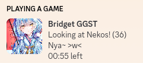
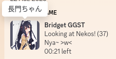
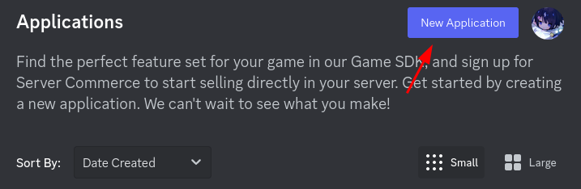
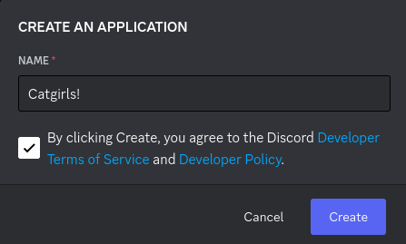
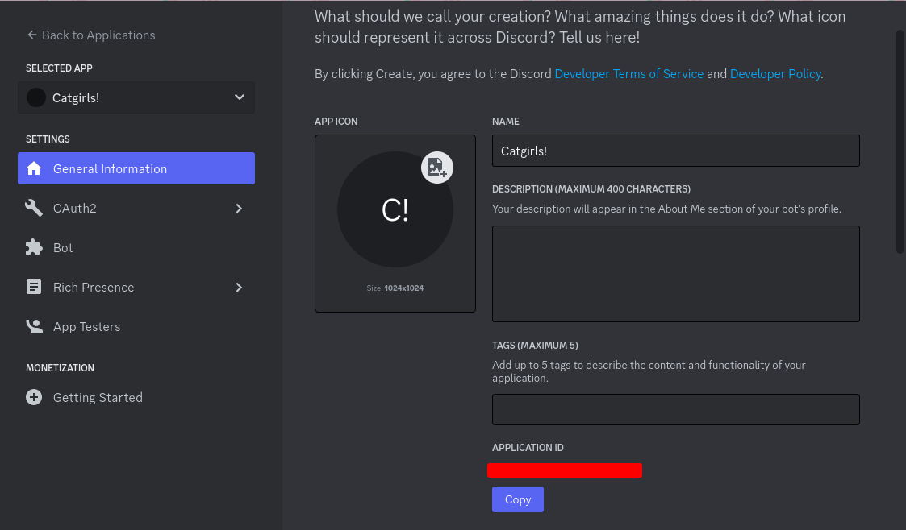

# Catgirl RPC

Small Discord RPC program for those who like nekos >w<

## Showcase



## Installation
Below you'll find the steps to install the app.

### Pre-requisites
When compiling from source, you'll need to install git, make and rustup.
Install rustup by running:
```bash
curl --proto '=https' --tlsv1.2 -sSf https://sh.rustup.rs | sh
```

Then install git and make.
```
# Arch Linux
sudo pacman -S git make

# Fedora
sudo dnf install git make

# Ubuntu
sudo apt install git make
```

Note that the app takes advantage of `systemd`. If your system doesn't support it, please do not use the Makefile. Instead, create a service for your init system.

### Using the releases tab.
Click the latest release on the repo, once it's downloaded, untar it, and open a terminal in the folder, then do:

```bash
sudo make bin_install
```

### Compiling from source
Open a terminal, then run the following commands.

```bash
git clone https://github.com/its-Lyn/catgirl_rpc
cd catgirl_rpc
```

Now, you can use the Makefile to build the project. This doesn't rely on any init system.
NOTE: Do not use sudo for this.

```bash
make build
```

After it's done, you can install it by:

```bash
sudo make install
```

## Usage and Configuration

The RPC uses systemd. So you can use systemctl commands to use it! <br>
But first, I'd recommend you open a terminal and run `catgirl_rpc`. This is so the app can create it's configuration files. <br>

Now, open a text editor and open the configuration file, it is located in `~/.config/catgirls/config.json` if the `XDG_CONFIG_HOME` variable is not set, otherwise it'll be located in `$XDG_CONFIG_HOME/catgirls/config.json`, and simply add your Application's ID!

```json
{
    "application_id": "your_id"
}
```

### Creating a Discord Application
Don't have an application you can use? Create a new one! It's simple!

First, open the [discord developer portal](https://discord.com/developers/applications), Log in with your discord account, if it prompts you to!

Then, create a new app! <br>


Now, give it a name and press create! <br>


You should now be put on this page, simply scroll down untill you see `APPLICATION ID` and then press `Copy`! <br>


## License
MIT